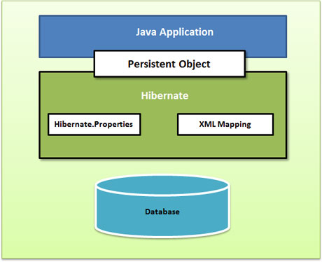

# 架构 

Hibernate 架构是分层的，让你保持脱离状态从而不必知道底层 API。Hibernate 利用数据库以及配置数据来为应用程序提供持续性服务（以及持续性对象）。

下面是一个非常高水平的 Hibernate 应用程序架构视图。

下面是一个详细的 Hibernate 应用程序体系结构视图以及一些重要的类。

Hibernate 使用不同的现存 Java API，比如 JDBC，Java 事务 API（JTA），以及 Java 命名和目录界面（JNDI）。JDBC 提供了一个基本的抽象级别的通用关系数据库的功能，允许几乎所有带有 JDBC 驱动的数据库可以由 Hibernate 支持。JNDI 和 JTA 允许 Hibernate 与 J2EE 应用程序服务器相集成。

下面的部分简要地描述了在 Hibernate 应用程序架构所涉及的每一个类对象。

## 配置对象

配置对象是你在任何 Hibernate 应用程序中创造的第一个 Hibernate 对象，并且经常只在应用程序初始化期间创造。它代表了 Hibernate 所需一个配置或属性文件。配置对象提供了两种基础组件。

- **数据库连接**：由 Hibernate 支持的一个或多个配置文件处理。这些文件是 **hibernate.properties** 和 **hibernate.cfg.xml**。
- **类映射设置**：这个组件创造了 Java 类和数据库表格之间的联系。

## SessionFactory 对象

配置对象被用于创造一个 SessionFactory 对象，使用提供的配置文件为应用程序依次配置 Hibernate，并允许实例化一个会话对象。SessionFactory 是一个线程安全对象并由应用程序所有的线程所使用。

SessionFactory 是一个重量级对象所以通常它都是在应用程序启动时创造然后留存为以后使用。每个数据库需要一个 SessionFactory 对象使用一个单独的配置文件。所以如果你使用多种数据库那么你要创造多种 SessionFactory 对象。

## Session 对象

一个会话被用于与数据库的物理连接。Session 对象是轻量级的，并被设计为每次实例化都需要与数据库的交互。持久对象通过 Session 对象保存和检索。

Session 对象不应该长时间保持开启状态因为它们通常情况下并非线程安全，并且它们应该按照所需创造和销毁。

## Transaction 对象

一个事务代表了与数据库工作的一个单元并且大部分 RDBMS 支持事务功能。在 Hibernate 中事务由底层事务管理器和事务（来自 JDBC 或者 JTA）处理。

这是一个选择性对象，Hibernate 应用程序可能不选择使用这个接口，而是在自己应用程序代码中管理事务。

## Query 对象

Query 对象使用 SQL 或者 Hibernate 查询语言（HQL）字符串在数据库中来检索数据并创造对象。一个查询的实例被用于连结查询参数，限制由查询返回的结果数量，并最终执行查询。

## Criteria 对象

Criteria 对象被用于创造和执行面向规则查询的对象来检索对象。