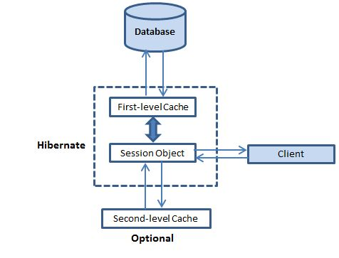

# 缓存  

缓存是关于应用程序性能的优化，降低了应用程序对物理数据源访问的频次，从而提高应用程序的运行性能。  

缓存对 Hibernate 来说也是重要的，它使用了如下解释的多级缓存方案：  

  

## 一级缓存

第一级缓存是 Session 缓存并且是一种强制性的缓存，所有的要求都必须通过它。Session 对象在它自己的权利之下，在将它提交给数据库之前保存一个对象。  

如果你对一个对象发出多个更新，Hibernate 会尝试尽可能长地延迟更新来减少发出的 SQL 更新语句的数目。如果你关闭 session,所有缓存的对象丢失，或是存留，或是在数据库中被更新。  

## 二级缓存

第二级缓存是一种可选择的缓存并且第一级缓存在任何想要在第二级缓存中找到一个对象前将总是被询问。第二级缓存可以在每一个类和每一个集合的基础上被安装，并且它主要负责跨会话缓存对象。  

任何第三方缓存可以和 Hibernate 一起使用。**org.hibernate.cache.CacheProvider** 接口被提供，它必须实现来给 Hibernate 提供一个缓存实现的解决方法。  

## 查询层次缓存

Hibernate 也实现了一个和第二级缓存密切集成的查询结果集缓存。  

这是一个可选择的特点并且需要两个额外的物理缓存区域，它们保存着缓存的查询结果和表单上一次更新时的时间戳。这仅对以同一个参数频繁运行的查询来说是有用的。  

## 第二级缓存

Hibernate 使用默认的一级缓存并且你不用使用一级缓存。让我们直接看向可选的二级缓存。不是所有的类从缓存中获益，所以能关闭二级缓存是重要的。  

Hibernate 的二级缓存通过两步设置。第一，你必须决定好使用哪个并发策略。之后，你使用缓存提供程序来配置缓存到期时间和物理缓存属性。  

## 并发策略

一个并发策略是一个中介，它负责保存缓存中的数据项和从缓存中检索它们。如果你将使用一个二级缓存，你必须决定，对于每一个持久类和集合，使用哪一个并发策略。  

- **Transactional:**为主读数据使用这个策略，在一次更新的罕见状况下并发事务阻止过期数据是关键的。
- **Read-write:**为主读数据再一次使用这个策略，在一次更新的罕见状况下并发事务阻止过期数据是关键的。  
- **Nonstrict-read-write:**这个策略不保证缓存和数据库之间的一致性。如果数据几乎不改变并且过期数据不是很重要，使用这个策略。  
- **Read-only:**一个适合永不改变数据的并发策略。只为参考数据使用它。  

如果我们将为我们的 **Employee** 类使用二级缓存，让我们使用 read-write 策略来添加需要告诉 Hibernate 来缓存 Employee 实例的映射元素。  

```
<?xml version="1.0" encoding="utf-8"?>
<!DOCTYPE hibernate-mapping PUBLIC 
 "-//Hibernate/Hibernate Mapping DTD//EN"
 "http://www.hibernate.org/dtd/hibernate-mapping-3.0.dtd"> 

<hibernate-mapping>
   <class name="Employee" table="EMPLOYEE">
      <meta attribute="class-description">
         This class contains the employee detail. 
      </meta>
      <cache usage="read-write"/>
      <id name="id" type="int" column="id">
         <generator class="native"/>
      </id>
      <property name="firstName" column="first_name" type="string"/>
      <property name="lastName" column="last_name" type="string"/>
      <property name="salary" column="salary" type="int"/>
   </class>
</hibernate-mapping>
```  

usage="read-write" 参数告诉 Hibernate 为定义的缓存使用 read-write 并发策略。  

## 缓存提供者

在考虑你将为你的缓存候选类所使用的并发策略后你的下一步是挑选一个缓存提供者。Hibernate 让你为整个应用程序选择一个单独的缓存提供者。  

|S.N.|缓存名|描述|
|:------|:-----|:-----|
|1|EHCache|它能在内存或硬盘上缓存并且集群缓存，而且它支持可选的 Hibernate 查询结果缓存。|
|2|OSCache|支持在一个单独的 JVM 中缓存到内存和硬盘，同时有丰富的过期策略和查询缓存支持。|
|3|warmCache|一个基于 JGroups 的聚集缓存。它使用集群失效但是不支持 Hibernate 查询缓存。| 
|4|JBoss Cache|一个也基于 JGroups 多播库的完全事务性的复制集群缓存。它支持复制或者失效，同步或异步通信，乐观和悲观锁定。Hibernate 查询缓存被支持。|

每一个缓存提供者都不和每个并发策略兼容。以下的兼容性矩阵将帮助你选择一个合适的组合。  

|策略/提供者|Read-only|Nonstrictread-write|Read-write|Transactional|
|:-----|:-----|:-----|:-----|:-----|
|EHCache|X|X|X||
|OSCache|X|X|X||
|SwarmCache|X|X|||
|JBoss Cache|X|||X|

你将在 hibernate.cfg.xml 配置文件中指定一个缓存提供者。我们选择 EHCache 作为我们的二级缓存提供者：  

```
<?xml version="1.0" encoding="utf-8"?>
<!DOCTYPE hibernate-configuration SYSTEM 
"http://www.hibernate.org/dtd/hibernate-configuration-3.0.dtd">

<hibernate-configuration>
   <session-factory>
   <property name="hibernate.dialect">
      org.hibernate.dialect.MySQLDialect
   </property>
   <property name="hibernate.connection.driver_class">
      com.mysql.jdbc.Driver
   </property>

   <!-- Assume students is the database name -->
   <property name="hibernate.connection.url">
      jdbc:mysql://localhost/test
   </property>
   <property name="hibernate.connection.username">
      root
   </property>
   <property name="hibernate.connection.password">
      root123
   </property>
   <property name="hibernate.cache.provider_class">
      org.hibernate.cache.EhCacheProvider
   </property>

   <!-- List of XML mapping files -->
   <mapping resource="Employee.hbm.xml"/>

</session-factory>
</hibernate-configuration>
```  

现在，你需要指定缓存区域的属性。EHCache 有它自己的配置文件，**ehcache.xml**，它应该在应用程序的 CLASSPATH 中。Employee 类的 ehcache.xml 缓存配置像如下这样：  

```
<diskStore path="java.io.tmpdir"/>
<defaultCache
maxElementsInMemory="1000"
eternal="false"
timeToIdleSeconds="120"
timeToLiveSeconds="120"
overflowToDisk="true"
/>

<cache name="Employee"
maxElementsInMemory="500"
eternal="true"
timeToIdleSeconds="0"
timeToLiveSeconds="0"
overflowToDisk="false"
/>
```  

就是这样，现在我们有 Employee 类的二级缓存并且 Hibernate 现在能命中缓存无论是你导航到 Employee 时或是当你通过标识符上传 Employee 时。  

你应该为每个类分析你所有的类并选择合适的缓存策略。有时候，二级缓存可能使应用程序的表现下降。所以首先不允许缓存用基准程序测试你的应用程序，然后开启合适的缓存，之后检测表现是推荐的。如果缓存不提升系统表现那么支持任何类型的缓存都是没有意义的。  

## 查询层次缓存

为了使用查询缓存，你必须首先使用配置文件中的 **hibernate.cache.use_query_cache="true"** 属性激活它。通过设置这个属性为真，你使得 Hibernate 创建内存中必要的缓存来保存查询和标识符集。  

然后，为了使用查询缓存，你使用 Query 类的 setCacheable(Boolean) 方法。例如：  

```
Session session = SessionFactory.openSession();
Query query = session.createQuery("FROM EMPLOYEE");
query.setCacheable(true);
List users = query.list();
SessionFactory.closeSession();
```  

Hibernate 通过缓存区域的概念也支持非常细粒度的缓存支持。一个缓存区域是被给予名字的缓存部分。  

```
Session session = SessionFactory.openSession();
Query query = session.createQuery("FROM EMPLOYEE");
query.setCacheable(true);
query.setCacheRegion("employee");
List users = query.list();
SessionFactory.closeSession();
```  

这段代码使用方法来告诉 Hibernate 存储和寻找缓存 employee 区域的查询。